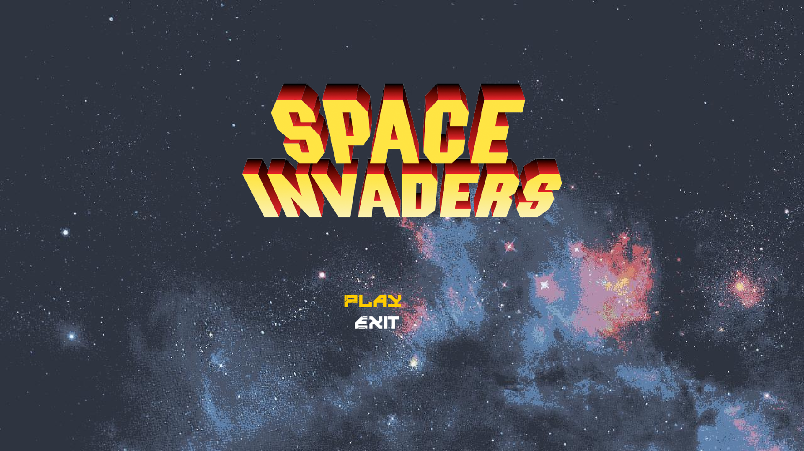
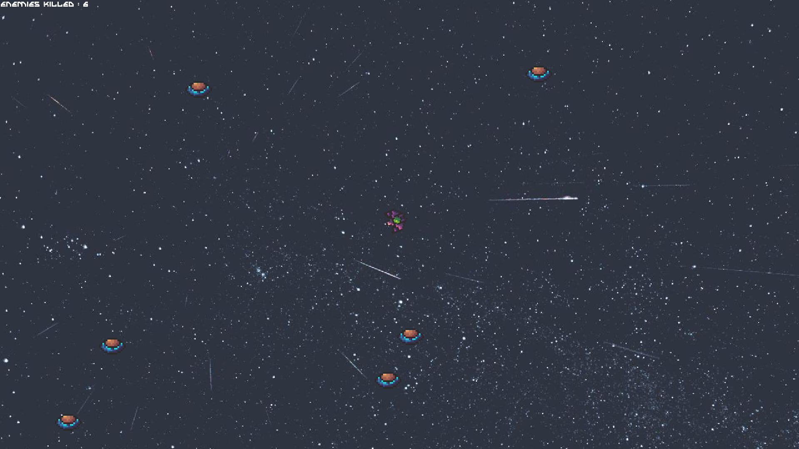

# Swag Lords




# Setup Project
Clone or
Download repo **[Space War](https://github.com/b1oss/SwagLords)**\
Unzip repository \
Go to project folder\
Type the following in terminal (Make sure you have Cmake)
### MinGW
```bash
mkdir build
cd build/
cmake -G "MinGW Makefiles" ..
mingw32-make.exe
./SpaceWar.exe
```
### MSVC
```bash
mkdir out
cd out/
cmake -G "Visual Studio 18 2026" ..
cmake --build . --config Debug
./Debug/SpaceWar.exe
```
